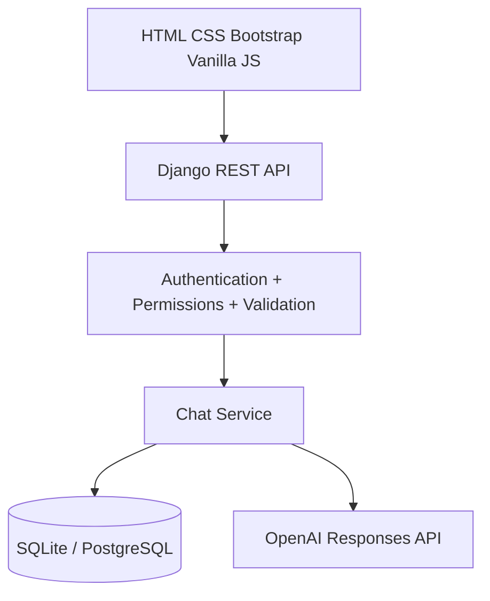

# Jays Assist

Jays Assist is a lightweight conversational AI web application built to demonstrate practical Django backend engineering: authentication, authorization, REST APIs, relational database design, service-layer separation, secure OpenAI integration, frontend integration, validation, error handling, testing, and deployment.

## Architecture



## Stack

- Python 3.x
- Django
- Django REST Framework
- OpenAI Python SDK
- SQLite locally
- PostgreSQL-compatible production configuration
- HTML5, CSS3, Bootstrap 5, Vanilla JavaScript
- python-dotenv
- WhiteNoise
- Gunicorn

## Features

- Registration, login, logout and current-user API
- Multiple independent conversation threads
- Persistent user and assistant messages
- Continue previous conversations
- Delete conversations
- Per-user thread authorization
- Configurable conversation history limit
- Dedicated OpenAI service
- Consistent JSON error handling
- Django admin
- Automated tests for authentication, authorization, persistence and provider failure

## Authentication choice

Jays Assist uses Django session authentication. The browser and Django app share the same origin, so Django's session system is simpler and easier to explain than introducing JWT infrastructure. POST requests use Django CSRF protection.

## Authorization

Every thread query is scoped with `user=request.user`. A thread ID alone is never treated as proof of ownership. A user who does not own a thread receives a not-found response rather than the other user's data.

## LLM integration

The browser never receives the OpenAI API key. JavaScript sends a message to Django; Django validates ownership, stores the user message, builds the configured conversation history, calls the OpenAI Responses API through `OpenAIService`, stores the assistant message, and returns JSON.

The current OpenAI Python SDK documents the Responses API as the primary interface for model responses and exposes provider errors such as `RateLimitError`, `APIConnectionError`, `APITimeoutError`, and `APIStatusError`. Jays Assist maps these failures to user-safe API responses. See the official SDK documentation for the current API behavior.

## Local setup

### 1. Create and activate a virtual environment

Windows PowerShell:

```powershell
python -m venv .venv
.\.venv\Scripts\Activate.ps1
```

### 2. Install dependencies

```bash
pip install -r requirements.txt
```

### 3. Configure environment

Copy `.env.example` to `.env` and set:

```env
DJANGO_SECRET_KEY=your-secret
DJANGO_DEBUG=True
DJANGO_ALLOWED_HOSTS=127.0.0.1,localhost
OPENAI_API_KEY=your-key
OPENAI_MODEL=gpt-5.5
MAX_HISTORY_MESSAGES=20
MAX_MESSAGE_LENGTH=10000
MAX_THREAD_TITLE_LENGTH=120
DATABASE_URL=
```

### 4. Create migrations

```bash
python manage.py makemigrations
python manage.py migrate
```

### 5. Create an admin user

```bash
python manage.py createsuperuser
```

### 6. Run tests

```bash
python manage.py test
```

### 7. Run the application

```bash
python manage.py runserver
```

Open `http://127.0.0.1:8000/`.

## API endpoints

| Method | Endpoint | Purpose |
|---|---|---|
| POST | `/api/auth/register/` | Register |
| POST | `/api/auth/login/` | Login |
| POST | `/api/auth/logout/` | Logout |
| GET | `/api/auth/me/` | Current user |
| GET | `/api/threads/` | List own threads |
| POST | `/api/threads/` | Create thread |
| GET | `/api/threads/<id>/` | Retrieve own thread |
| DELETE | `/api/threads/<id>/` | Delete own thread |
| GET | `/api/threads/<id>/messages/` | Retrieve own thread messages |
| POST | `/api/threads/<id>/messages/` | Store message and generate AI response |

## Error handling

- 400 validation/authentication input errors
- 401/403 authentication failures handled by DRF
- 404 missing or non-owned threads
- 429 OpenAI rate limits
- 502 provider/network failures
- 503 missing OpenAI configuration
- 500 unexpected server errors

Provider credentials and stack traces are not sent to the browser.

## Security

- Environment variables for secrets
- Django password hashing
- Session authentication
- CSRF protection
- Same-origin frontend/API communication
- Server-side authorization checks
- No OpenAI API key in frontend code
- Production `DEBUG=False`
- Secure cookies in production
- `ALLOWED_HOSTS` from environment
- WhiteNoise for static files

## Deployment on Render

Use a Python web service with a build command such as:

```bash
pip install -r requirements.txt && python manage.py collectstatic --noinput && python manage.py migrate
```

Start command:

```bash
gunicorn config.wsgi:application
```

Set production environment variables in Render. Use a managed PostgreSQL database and set `DATABASE_URL`. Set `DJANGO_DEBUG=False`, a production `DJANGO_SECRET_KEY`, the Render hostname in `DJANGO_ALLOWED_HOSTS`, and the OpenAI key in `OPENAI_API_KEY`.

## Known limitations

- Attachments are visually present in the UI but are not uploaded to the backend in this version.
- Search is a UI placeholder; the core project is focused on conversational AI rather than web search.
- The current conversation history strategy keeps the latest configured number of messages; it does not summarize old conversations.
- Streaming responses are not implemented in the first version.

## Future improvements

- Streaming assistant responses
- File attachments
- Search integration
- Conversation title editing
- PostgreSQL-backed production analytics
- Rate limiting at the application layer
- More granular account/profile settings

## Code quality

Format and lint with Black, isort and Pylint. Keep Django-specific configuration simple and explainable rather than adding abstractions only to increase tooling scores.
